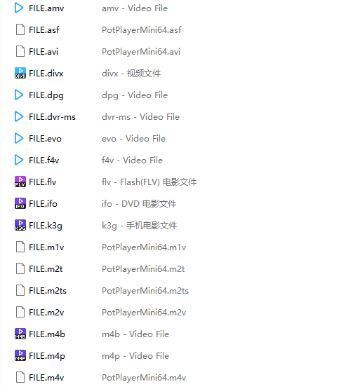

# ExtensionTestFile

[](#)
[](#)
[](LICENSE)

一键生成各类常见格式的“空文件”，你可以直观地通过**文件图标**的变化，判断这些扩展名是否已正确关联到你安装的播放器。

- **轻量**：生成的文件占用极小（仅5 bytes/个）。
- **分类**：自动归类 `视频`、`音频`、`播放列表` 三个文件夹。

## 📸 部分展示


## 📂 支持的格式

### 📺 视频(Video)
```text
avi wmv wmp wm asf mpg mpeg mpe m1v m2v mpv2 mp2v ts tp tpr trp vob ifo ogm ogv mp4 m4v m4p m4b 3gp 3gpp 3g2 3gp2 mkv rm ram rmvb rpm flv mov qt nsv dpg m2ts m2t mts dvr-ms k3g skm evo nsr amv divx webm wtv f4v mxf
```

### 🎵 音频 (Audio)
```text
wav wma mpa mp2 m1a m2a mp3 ogg m4a aac mka ra flac ape mpc mod ac3 eac3 dts dtshd wv tak cda dsf tta aiff aif opus
```

### 📜 播放列表 (Playlist)
```text
asx m3u m3u8 pls wvx wax wmx cue mpls mpl dpl xspf mpd
```

## ⬇️ 下载使用

前往 [Releases](https://github.com/NeetheCheeBao/ExtensionTestFile/releases) 页面下载

## 🛠️ 本地编译
```bash
.\build.bat
```
或
```python
pyinstaller -F -w -n CreateExtensionTestFile.x86 main.py
```

## ⚖️ 许可证

本项目采用 MIT 许可证 - 详情请参阅 [LICENSE](LICENSE) 文件。